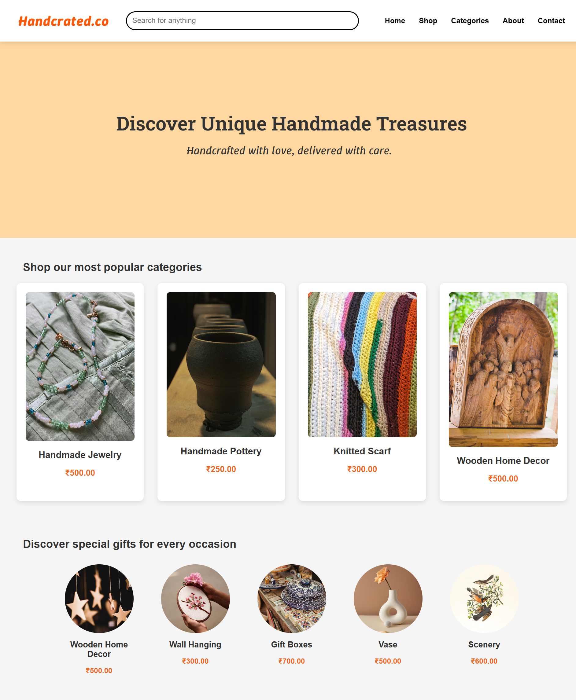

## **Handcrafted.co – Static Website for Handmade Products**

Handcrafted.co is a static, multi-page website built using HTML and CSS. It showcases a clean and aesthetic user interface for an online store that features handmade goods such as jewelry, pottery, woodcraft, and more.

### **Pages Included**

Home – Introduction to the platform with a featured banner

Categories – Lists categories like Jewelry, Pottery, Woodcraft, etc.

Shop – Displays products 

About – Highlights the brand and mission

Contact – Simple contact section with form and contact info

### **Preview**

### **Tech Stack**

HTML5 - Structure of the pages

CSS3 - Styling and layout

### **Getting Started**

git clone https://github.com/RiddhiBansal04/handcrafted.co.git

cd handcrafted.co

Then open index.html in your browser.

### **Author**

Riddhi Bansal
